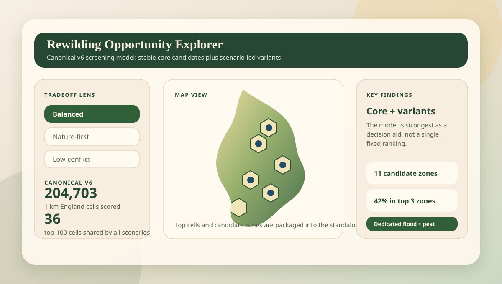
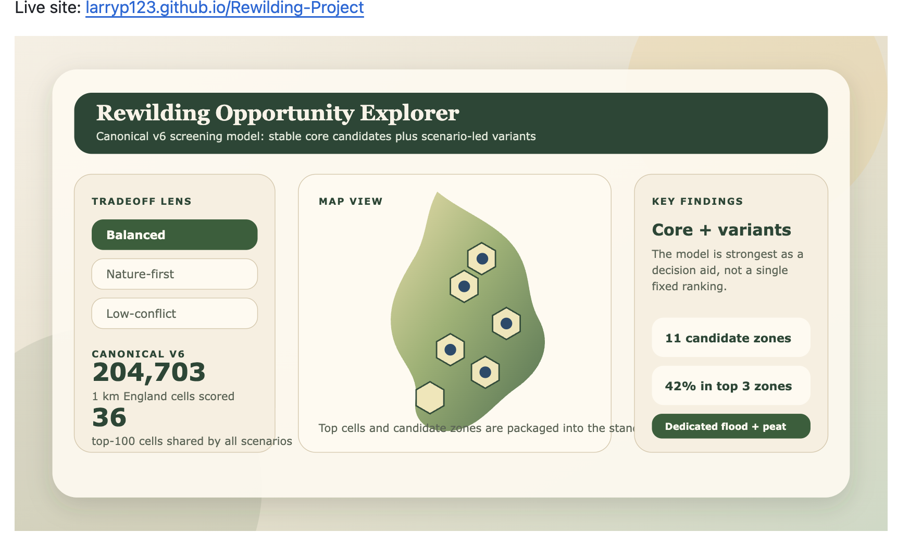
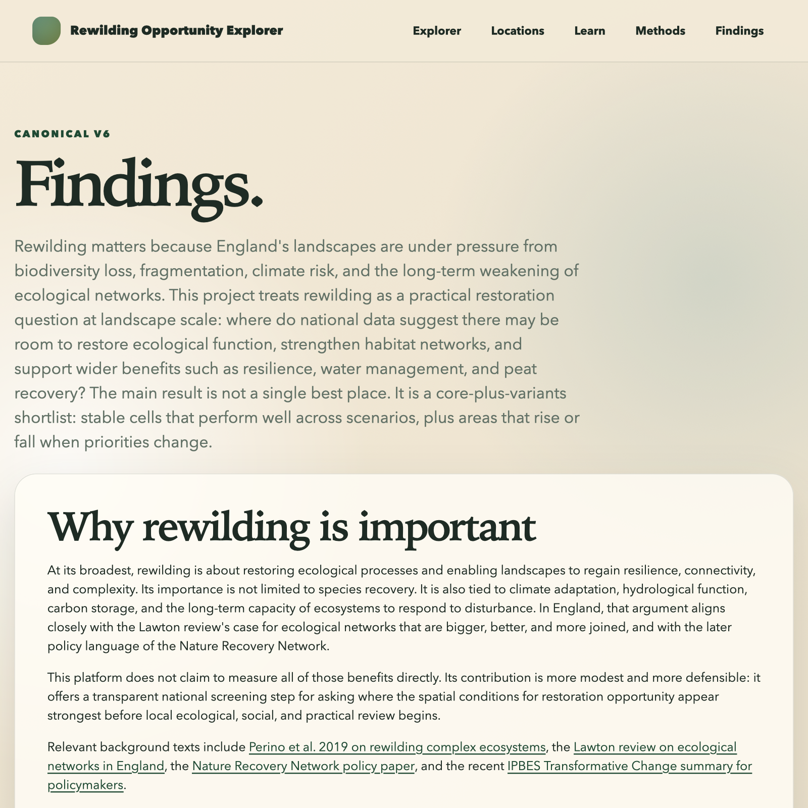
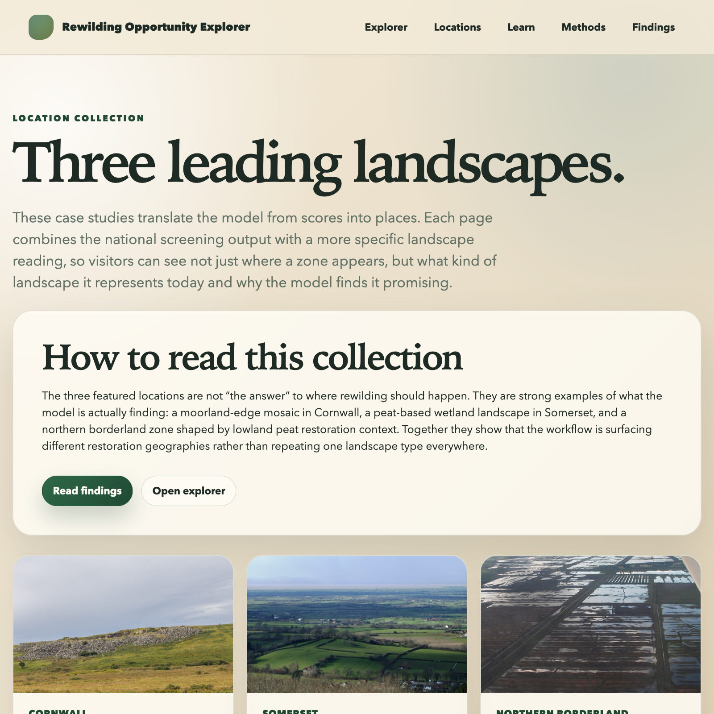

# Rewilding Suitability

A reproducible geospatial screening workflow and public-facing explorer for identifying possible rewilding opportunity areas across England.
It combines habitat, biodiversity observation, agricultural, flood, and peat-related signals into 1 km opportunity scores, candidate-zone summaries, validation outputs, and an interactive site.
It is meant to narrow England down to plausible landscapes for further review, not to make site-level recommendations or predict ecological outcomes.

Live site: [larryp123.github.io/Rewilding-Project](https://larryp123.github.io/Rewilding-Project/)

This model looks across England, compares places using a handful of national environmental signals, and highlights the areas that seem more worth investigating for rewilding. It does not decide where rewilding should happen. It shrinks a very large map into a shortlist people can inspect and question.

## Exactly what the model does

The model is not a predictor in the usual machine-learning sense.
It is a rule-based national screening tool.
It divides England into 1 km hexagons, checks each hexagon against several national datasets, turns those inputs into component scores, and combines those scores into three final scenario views.

That means its conclusion is not "rewild here."
It is closer to: "based on these datasets and assumptions, these places look more worth investigating than most others."

## Which data it uses

The current published run combines:

- England boundary data to define the study area
- CORINE land cover for habitat context and proximity to semi-natural land
- Agricultural Land Classification as a rough lower-conflict proxy
- dedicated flood data to capture floodplain or wetland restoration context
- dedicated peat data to capture peat-related restoration context
- bird and mammal observation records from England as a cautious biodiversity signal

## How it gets to its scores

For each 1 km hexagon, the workflow:

1. measures how much existing habitat is already there
2. measures how close the cell is to existing habitat
3. checks the dominant agricultural land grade
4. measures flood and peat presence and proximity
5. counts bird and mammal records and dampens cells with sparse recording effort
6. converts those pieces into comparable component scores
7. combines them into three final scenario scores: `nature-first`, `balanced`, and `lower-conflict`

## What kind of scoring model this is

This is a **weighted multi-criteria scoring model**.
It is not a machine-learning predictor and it is not a plain average.

The core idea is:

1. different kinds of evidence are **standardised** onto a common `0-100` scale
2. those standardised indicators are **weighted** according to their importance in a given scenario
3. the weighted indicators are combined into a **composite score** using a **weighted linear combination**

This allows unlike variables, such as habitat proximity, agricultural land quality, biodiversity records, flood context, and peat context, to be compared consistently in one framework.

In practical terms, a higher final score means a cell looks more promising **relative to other cells in the same model run**, given the selected inputs and assumptions.

For a structure-style overview of the canonical model, see the [canonical scoring structure](docs/visual_model.md#canonical-scoring-structure).

The model is mainly looking for places that combine:

- closeness to existing habitat networks
- room for restoration
- some biodiversity signal
- lower agricultural conflict
- floodplain or wetland opportunity
- peat restoration opportunity

It then ranks cells nationally, identifies clusters of neighbouring high-scoring cells, and turns those into the shortlists, maps, and case-study outputs shown in the repository and on the site.

## What the result means

A high score means a place looks promising under the chosen scenario, given the signals in the model.
It does not prove ecological outcome, land availability, deliverability, local consent, or cost.
It is best used as a shortlist for closer human review.



| Home | Findings | Locations |
| --- | --- | --- |
|  |  |  |

## At a glance

- National-scale spatial screening project for England
- Canonical 1 km hex-grid release with `204,703` scored cells
- Scenario-based ranking under nature-first, balanced, and lower-conflict lenses
- Public-facing site in `docs/` with findings, methods, locations, and explorer pages
- Built as decision support for discussion and follow-up, not final site selection

## Project highlights

### Academic showcase site

The repository now includes a lightweight static site under `docs/` that turns the model outputs into a clearer public-facing narrative:

- landing page,
- learn and methods pages,
- findings summary,
- dedicated location case studies,
- and an interactive explorer.

Start here:

- [Site home](docs/index.html)
- [Findings](docs/findings.html)
- [Locations](docs/locations.html)
- [Explorer](docs/maps/rewilding_opportunity_explorer.html)

### What the model is strongest at

The project works best when framed as a transparent spatial screening workflow:

- it compares places under multiple scenario lenses,
- makes assumptions inspectable,
- highlights stable core candidates versus scenario-specific variants,
- and connects spatial outputs to literature and policy context.

### What it does not claim

This project does not claim to:

- identify final rewilding sites,
- predict ecological outcomes or delivery feasibility,
- replace local ecological assessment, ownership review, or policy due diligence,
- or serve as a causal model of biodiversity recovery, carbon outcomes, or flood performance.

High-ranking cells should be treated as candidate areas for follow-up, not recommendations in themselves.

## Project status

This repository is currently set up for an MVP focused on England and a 1 km hex grid.
The immediate goal is to build a reproducible geospatial pipeline that:

- ingests raw environmental layers,
- standardises them into a common CRS and storage format,
- aggregates features to a shared analysis grid,
- produces scenario-based suitability scores,
- prepares outputs for notebooks, reports, and an interactive map app.

## MVP scope

The first version prioritises layers that are practical to integrate and defensible as decision-support signals:

- land cover context,
- existing priority habitat,
- observation-based bird and mammal layers built from verified NBN/iRecord records,
- agricultural land quality,
- flood opportunity from a dedicated Environment Agency style flood layer,
- England boundary for the analysis extent plus optional LNRS geography for policy slicing and summaries.

The biodiversity dimension now combines bird and mammal observation indicators rather than relying on birds alone.
It is still a pragmatic screening proxy rather than a full biodiversity model, and it remains sensitive to recording effort.
The canonical published run requires dedicated flood and peat source datasets.
CORINE is retained only as an explicit local-development fallback so the pipeline can still run before those raw layers are added locally.

## What This Project Is

This project is a national spatial screening workflow for England.
Its job is to turn a defined set of land-focused inputs into comparable 1 km cell scores under a small number of policy-style scenario lenses.
Those scores are then packaged into shortlist exports, cluster summaries, validation notes, and an interactive explorer so the outputs can be reviewed and challenged.

The canonical published workflow in this repository:

- builds or reuses a national 1 km hex grid for England,
- derives habitat, biodiversity-observation, agricultural, flood, and peat-related features per cell,
- scores each cell under `scenario_nature_first`, `scenario_balanced`, and `scenario_low_conflict`,
- exports shortlist and candidate-zone outputs from the same scored layer,
- and packages those outputs into documentation and a standalone HTML explorer.

For a visual overview of how the data, scoring model, scenarios, validation, and outputs fit together, see [docs/visual_model.md](docs/visual_model.md). For the concise portfolio-style interpretation of the latest run, see [docs/findings.md](docs/findings.md).

## Repository structure

```text
data/
  raw/                Raw source files
  interim/            Standardised and subsetted data products
notebooks/            Exploration and analysis notebooks
outputs/              Methods and supporting project notes
src/                  Reusable pipeline code
```

## Planned pipeline

1. Ingest raw layers and record source metadata.
2. Reproject all geometry to British National Grid (`EPSG:27700`).
3. Build a 1 km hex grid for England.
4. Derive per-hex feature tables for habitat, biodiversity, agriculture, flood, and peat.
5. Score each hex under multiple scenarios.
6. Export map-ready outputs.

## Getting started

Create an environment and install the package in editable mode:

```bash
python -m venv .venv
source .venv/bin/activate
pip install -e ".[dev]"
```

Example workflow in Python:

```python
from pathlib import Path

import geopandas as gpd

from src.build_grid import build_hex_grid
from src.features import add_habitat_share_feature, add_alc_opportunity_feature
from src.score import apply_scenarios

england = gpd.read_file(Path("data/raw/boundaries/england_boundary.gpkg")).to_crs(27700)
grid = build_hex_grid(england, cell_diameter_m=1000)
```

Current MVP runner:

```python
from pathlib import Path

from src.pipeline import build_mvp_outputs

build_mvp_outputs(out_dir=Path("data/interim/mvp"), cell_diameter_m=20000)
```

Canonical published run with the official England boundary and dedicated flood/peat inputs:

```bash
python scripts/run_official_boundary_mvp.py --cell-diameter-m 1000
```

End-to-end canonical publication pass from one scored run:

```bash
python scripts/publish_canonical_run.py --verbose
```

If the raw dedicated flood and peat layers are very large, prepare simplified
scoring-ready versions first:

```bash
python scripts/prepare_canonical_sources.py
```

With dedicated flood and peat layers supplied explicitly:

```bash
python scripts/run_official_boundary_mvp.py \
  --cell-diameter-m 1000 \
  --flood-path data/raw/flood/ea_flood_zones.gpkg \
  --peat-path data/raw/peat/england_peat_map.gdb \
  --peat-layer peaty_soil_extent_v1
```

The runner now caches the cleaned ALC layer at `data/interim/alc_clean.parquet`
and reuses existing boundary, CORINE, habitat, grid, and score outputs inside
the chosen `--out-dir` when present. Use `--no-reuse-existing` if you want to
force a rebuild.

Export top-ranked candidate hexes from the canonical scored layer:

```bash
python scripts/export_top_candidates.py \
  --scores-path data/interim/mvp_official_boundary_1km_v6/hex_scores.parquet \
  --scenario scenario_balanced \
  --top-n 100
```

Add LNRS names and policy-area summaries when an LNRS boundary layer is available:

```bash
python scripts/export_top_candidates.py \
  --scores-path data/interim/mvp_official_boundary_1km_v6/hex_scores.parquet \
  --scenario scenario_balanced \
  --top-n 100 \
  --lnrs-path data/raw/reference/lnrs_boundaries.geojson
```

Generate clustered candidate zones with LNRS slicing carried through to the zone summary:

```bash
python scripts/summarize_candidate_clusters.py \
  --scores-path data/interim/mvp_official_boundary_1km_v6/hex_scores.parquet \
  --scenario scenario_balanced \
  --top-n 100 \
  --lnrs-path data/raw/reference/lnrs_boundaries.geojson
```

Both export scripts also accept `--bng-path` to flag candidate hexes and zones
that overlap a registered off-site Biodiversity Gain Site, using the same
point-in-polygon join as LNRS. This only matches if the supplied file has
polygon geometry — the real-world source below is point geometry (site
markers, not boundaries), so this join will not match anything against it.
It is kept for a future polygon-boundary release of the register; for the
current point data, use `apply_bng_opportunity_score.py` below instead.

There is no official bulk download from the government register itself (it's
a lookup-only public register at `environment.data.gov.uk/biodiversity-net-gain`),
but The Wildlife Trusts host a daily-updated copy of the register as a public
ArcGIS Feature Layer, queryable without authentication:

```bash
curl -s "https://services-eu1.arcgis.com/Y9jgVEvgymHqAYPW/arcgis/rest/services/BNGSitesTEST/FeatureServer/0/query?where=1%3D1&outFields=*&f=geojson" \
  -o data/raw/reference/bng_gain_sites.geojson
```

This returns ~300 registered sites as points (`Reference`, `LPA`, `site_size`,
and a `boundary_url` link to the official register's site boundary PDF) in
WGS84 — `apply_bng_opportunity_score.py` reprojects it to match the hex grid
automatically. `data/raw/reference/` is gitignored, so this stays local.

```bash
python scripts/export_top_candidates.py \
  --scores-path data/interim/mvp_official_boundary_1km_v6/hex_scores.parquet \
  --scenario scenario_balanced \
  --top-n 100 \
  --bng-path data/raw/reference/bng_gain_sites.geojson
```

Once a BNG sites file is available, compute a `scenario_bng_aligned` lens that
combines the core suitability signals with proximity to registered off-site
gain sites. This reads the canonical scored layer read-only and writes a
separate augmented file — it does not touch the canonical outputs or the
national pipeline:

```bash
python scripts/apply_bng_opportunity_score.py \
  --scores-path data/interim/mvp_official_boundary_1km_v6/hex_scores.parquet \
  --bng-path data/raw/reference/bng_gain_sites.geojson
```

Build a QGIS project comparing rewilding opportunity to the real BNG register
directly, for opening and exploring in desktop GIS software rather than a
script (requires QGIS installed; the GeoPackage is regenerated each run and
gitignored, so it isn't committed):

```bash
python scripts/build_bng_qgis_project.py
open -a QGIS outputs/qgis/bng_alignment.qgs
```

This writes `outputs/qgis/bng_alignment.gpkg` (hex scores, the England
boundary, and the 312 registered BNG sites, all in EPSG:27700) plus a `.qgs`
project with a graduated choropleth on `scenario_balanced` and the BNG sites
styled as a separate point layer, ready to inspect, restyle, or lay out a
print composition from directly in QGIS.

Right now the local-development workflow can use:

- the local `data/interim/corine_subset.parquet` layer for habitat-context features,
- cached observation-based bird and mammal layers downloaded from NBN Atlas verified iRecord records for England,
- dedicated flood and peat layers under `data/raw/flood/` and `data/raw/peat/`, with explicit CORINE fallback proxies reserved for non-canonical local runs,
- and a proxy analysis boundary derived from available ALC coverage when no official England boundary is supplied.

The current biodiversity workflow is intentionally controlled in scope:

- birds remain the original observation taxon,
- mammals are the single Phase 2 addition,
- each taxon is aggregated to the 1 km hex grid as species richness plus record count,
- each taxon score is damped by a simple record-coverage term before entering scenario scoring,
- and the scenario layer uses a combined `biodiversity_observation_score_raw` so biodiversity is no longer bird-only.

This does not remove observation bias. It only makes that bias more explicit and a little less fragile:

- richness without enough records is down-weighted,
- absence of records is treated as low confidence rather than ecological absence,
- and hotspots may still partly reflect where active recorders spend time.

The current canonical published result is the dedicated-data 1 km stack rooted
at `data/interim/mvp_official_boundary_1km_v6/hex_scores.parquet`. Local reruns
that use proxy fallback can coexist for development and smoke testing, but they
should not be treated as published outputs.
The corresponding release checkpoint is written to
`outputs/release/canonical_v6.json`, with `outputs/release/latest.json` updated
to the same payload after a successful canonical publish pass.

## Outputs

The main intended outputs are:

- a scored geospatial layer for England hexes,
- scenario tables for ranking candidate areas under different policy lenses,
- LNRS-sliced shortlist and candidate-zone summaries when LNRS geography is supplied,
- methods and assumptions documentation,
- notebooks for validation and case studies,
- a standalone interactive map application.

Build the packaged shortlist explorer:

```bash
python scripts/build_map_app.py \
  --scores-path data/interim/mvp_official_boundary_1km_v6/hex_scores.parquet
```

This writes a self-contained HTML app to
`outputs/app/rewilding_opportunity_explorer.html`. The app packages the union
of the top-ranked cells from each scenario, supports scenario switching and
interactive filtering, and includes a per-cell explanation panel that exposes
the weighted score components.

## Interpretation

The most useful reading of this repository is:
"given this set of inputs and assumptions, which parts of England repeatedly look promising enough to justify closer review?"

That is a much narrower claim than "where rewilding should happen."
The outputs are intended to support screening, discussion, and challenge, not to close the decision.

## Validation and regression checks

The repo now includes a small hardening layer for local and CI validation:

- `pytest` exercises spatial overlay / nearest-join behavior and score-range guards.
- `python -m src.data_manifest` validates that the key raw and interim datasets tracked in `data/manifest.toml` are present.

Run both locally with:

```bash
pytest
python -m src.data_manifest
```

## Notes

Generated project outputs live in `outputs/`.
