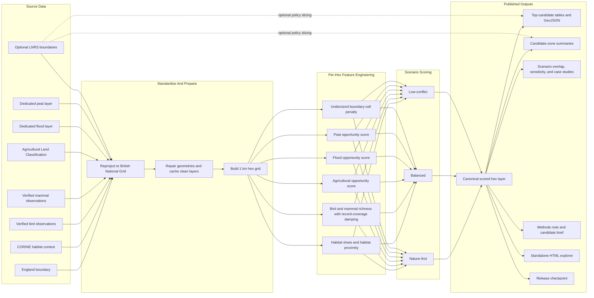
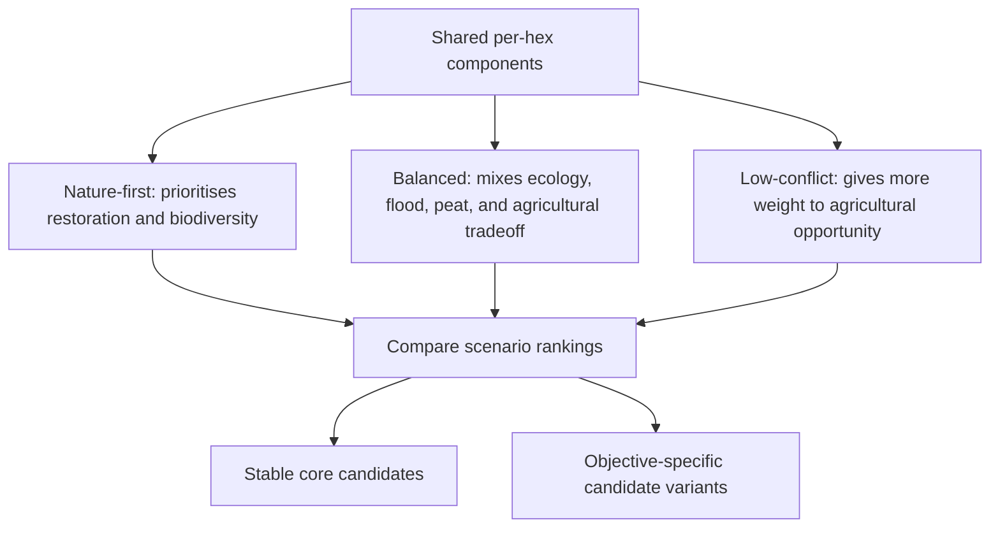

# Visual Model

This project is a screening model, not a site-selection model. The visual below shows how source layers become 1 km cell features, scenario scores, validation outputs, and the published map app.

## Score Components

The canonical score layer combines six main score families:

| Component | Meaning | Direction |
| --- | --- | --- |
| Restoration opportunity | High where cells are close to habitat but still have restoration headroom | Higher is better |
| Biodiversity observation | Bird and mammal species richness, damped by record coverage | Higher is better |
| Agricultural opportunity | Lower agricultural tradeoff based on ALC grade | Higher is lower conflict |
| Flood opportunity | Dedicated flood-source opportunity signal | Higher is more opportunity |
| Peat opportunity | Dedicated peat-source opportunity signal | Higher is more opportunity |
| Boundary penalty | Downweights clipped boundary/coastal cell fragments | Higher is less penalised |

## Scenario Logic

The model is most useful when read as a **core-plus-variants decision aid**:

- The stable core contains cells that remain strong across all three scenarios.
- Nature-first variants show places that rise when ecological opportunity matters most.
- Low-conflict variants show places that rise when lower agricultural tradeoff matters most.

## Current Canonical Release

- Release: `canonical_v6`
- Scored layer: `data/interim/mvp_official_boundary_1km_v6/hex_scores.parquet`
- Release checkpoint: `outputs/release/canonical_v6.json`
- Explorer app: `outputs/app/rewilding_opportunity_explorer.html`

