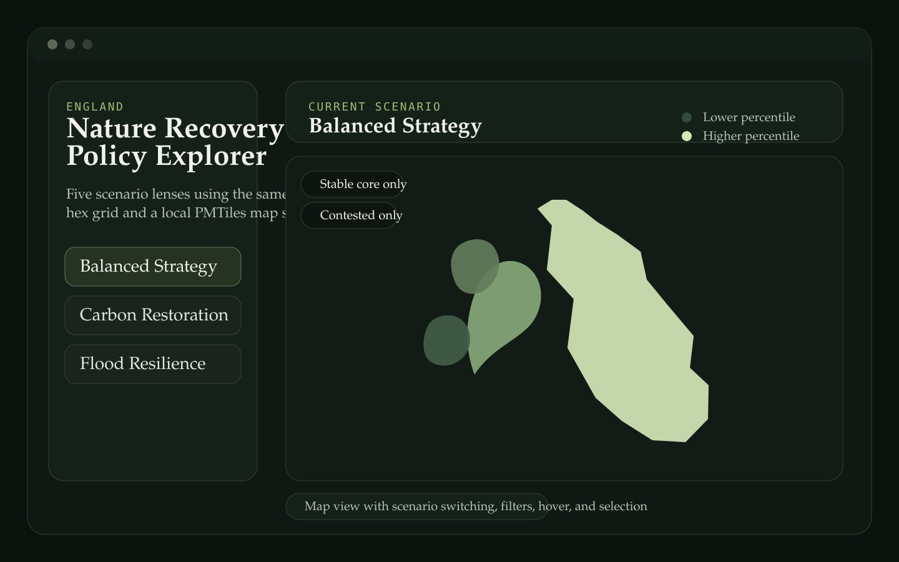
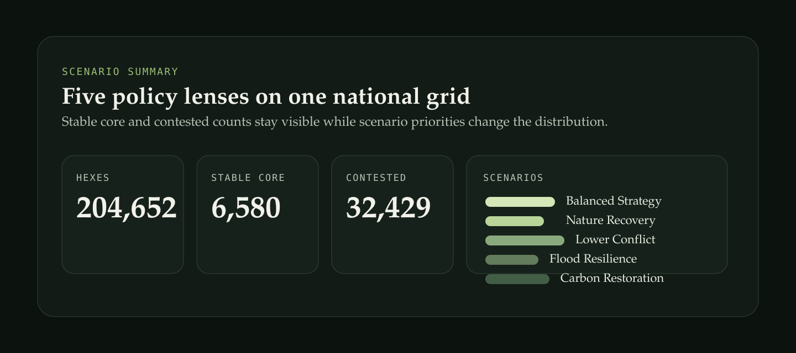

# Nature Recovery Policy Explorer

## Overview

This project compares how different policy priorities reshape the national
pattern of nature recovery opportunity across England.

The current build combines a DuckDB + dbt scoring pipeline, publish exports,
and a working MapLibre interface backed by PMTiles.



## Key Points

- national hex-based comparison across five policy scenarios
- shared underlying geography, recoloured by active scenario percentile
- stable-core and contested filters for cross-scenario interpretation
- local PMTiles delivery for a cleaner long-term map stack
- selection, hover, and scenario summary panels in the app

## Current Outputs

The present publish layer covers `204,652` hexes across England.

- `6,580` hexes appear in the stable core across all five scenarios
- `32,429` hexes are contested across scenarios
- each scenario exposes top-decile, top-1%, best-rank, and rank-spread outputs

Additional notes and headline observations are in [docs/findings.md](./docs/findings.md).

## Stack

- DuckDB
- dbt-duckdb
- Parquet / GeoParquet
- Python
- PMTiles
- MapLibre GL JS

## Current State

This repo currently includes:

- staged canonical hex base
- per-scenario scoring model
- cross-scenario comparison model
- publish exports for app use
- a working PMTiles layer
- a MapLibre app with scenario switching, filters, hover, selection, and shareable view state

## Repository Structure

Core project files:

- `dbt/models/staging/stg_hex_base.sql`
- `dbt/models/marts/fct_scenario_scores.sql`
- `dbt/models/marts/fct_scenario_comparison.sql`
- `dbt/models/exports/app_hexes.sql`
- `dbt/models/exports/scenario_summary.sql`
- `scripts/export_publish_assets.py`
- `scripts/build_pmtiles.sh`
- `app/maplibre/`

Analytical tables produced by the models:

- `hex_base`
- `scenario_scores`
- `scenario_comparison`
- `app_hexes`
- `scenario_summary`

App-facing publish assets generated locally:

- `data/publish/app_hexes.parquet`
- `data/publish/app_hexes_tiles.fgb`
- `data/publish/policy_hexes.pmtiles`
- `data/publish/scenario_summary.parquet`
- `data/publish/scenario_summary.json`
- `data/publish/app_overview.json`
- `data/publish/tile_schema.json`

## Rebuild Workflow

### 1. Run dbt models and seeds

```bash
cd /Users/laurencepengelly/rewilding-suitability/nature-recovery-policy-explorer
DBT_PROFILES_DIR=profiles .venv/bin/dbt seed --project-dir dbt
DBT_PROFILES_DIR=profiles .venv/bin/dbt run --project-dir dbt
DBT_PROFILES_DIR=profiles .venv/bin/dbt test --project-dir dbt
```

### 2. Export publish assets

```bash
.venv/bin/python scripts/export_publish_assets.py
```

This writes the app-facing files into `data/publish/`.

### 3. Build PMTiles

```bash
./scripts/build_pmtiles.sh
```

This builds `data/publish/policy_hexes.pmtiles`.

### 4. Serve locally

Use the byte-range server from the repo root:

```bash
cd /Users/laurencepengelly/rewilding-suitability
python3 scripts/serve_range_http.py --port 8003 --root /Users/laurencepengelly/rewilding-suitability
```

Then open:

- `http://localhost:8003/nature-recovery-policy-explorer/app/maplibre/`

## Interface

The current MapLibre interface supports:

- five scenario switches
- stable-core and contested filters
- hover inspection
- click selection with per-hex details
- a copyable URL state for scenario and filter settings



## Notes

- publish artifacts in `data/publish/` are generated locally and are ignored by Git
- backup virtual environments are also ignored locally
- `policy_hexes_z9.pmtiles` and `app_hexes_tiles_4326.fgb` remain useful as development artifacts, but they are not part of the tracked repo surface
